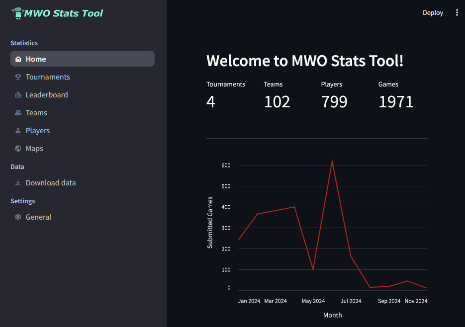

<!-- PROJECT SHIELDS -->
[![Contributors][contributors-shield]][contributors-url]
[![MIT License][license-shield]][license-url]
[![][version-shield]][version-url]

<!-- PROJECT NAME -->
<br/>
<div align="center">
    <a href="https://github.com/iT-Drake/MWOCompStatsVisualization">
        
    </a>
    <h3 align="center">MWO Competitive Stats Visualization</h3>
    <p align="center">
        A web application that helps you visualize data from competitive matches.
    </p>
</div>

<details>
  <summary>Table of contents</summary>

- [About The Project](#about-the-project)
- [Getting Started](#getting-started)
  - [Deployment](#deployment)
  - [Data-files structure](#data-files-structure)
    - [Mech data](#mech-data)
    - [Team rosters](#team-rosters)

</details>

<!-- ABOUT THE PROJECT -->
## About The Project



This application is designed to fetch API data, store it during the tournament and visualize stats for teams and pilots.

<!-- GETTING STARTED -->
## Getting Started

### Deployment

For a Linux-based system:
- Make a folder for the project
- Initialize Git and clone repository:
  ```shell
  git init
  git clone https://github.com/iT-Drake/MWOCompStatsVisualization.git
  ```
- Create virtual environment with Python, activate it and install dependencies:
  ```shell
  python3 -m venv .venv
  . .venv/bin/activate
  .venv/bin/pip install -r requirements.txt
  ```
- Make a file for environment variables, name it `.env` (note that dot in the name), add your values to it:
  ```
  ; Title will be displayed at the top of the page
  APP_TITLE=Statistics for a tournament

  ; Database file name let you store data for different tournaments in separate files
  DB_NAME=Tournament.sqlite3

  ; URL template, stays the same until PGI will change it
  API_URL=https://mwomercs.com/api/v1/matches/%1?api_token=%2

  ; Your key from https://mwomercs.com/profile/api
  API_KEY=<provided_key>

  ; CSV filename or a link to a shared google spreadsheet with mech data
  MECH_DATA_URL=https://docs.google.com/spreadsheets/d/<YOUR_DOCUMENT_ID>/export?format=csv&gid=<YOUR_PAGE_ID>

  ; CSV filename or a link to a shared google spreadsheet with team rosters
  ROSTERS_URL=Rosters.csv
  ```
- Run `Streamlit`:
  ```shell
  streamlit run app.py
  ```
- Run your browser, go to `http://serveraddress:8501` and test the application.

### Data-files structure

#### Mech data

API data contains only PGI-coded id of the mech and no information about its name or weight class. So it is needed to provide additional information to make API data human readable. Mech data file should have the following structure:
| Index | ItemID  | OriginalName  | Name    | Chassis | Tonnage | Class   | Type    |
|-------|---------|---------------|---------|---------|---------|---------|---------|
| 1     | 1       | hbk-4g        | HBK-4G  | HBK     | 50      | MEDIUM  | NORMAL  |
| 2     | 57      | com-tdk       | COM-TDK | COM     | 25      | LIGHT   | HERO    |

You don't need OriginalName in this tool, but you can get it with all the item ids from [mwomercs](https://static.mwomercs.com/api/mechs/list/dict.json).
You can find a template file with recent data [here](data/mechdata.csv).

#### Team rosters

API data does contain player name as it is set in their profile at the moment you make an API call, but there are no information about the team, besides the map side they are started at. You need to provide roster data to identify which team a pilot played for. Data should have the following structure:
| Index | Pilot | Team      |
|-------|-------|-----------|
| 1     | Name  | Team name |

Index column should be the first one on the left, order of the rest does not matter.
You can find a template file [here](data/rosters.csv).

<!-- MARKDOWN LINKS & IMAGES -->
[contributors-shield]: https://img.shields.io/github/contributors/iT-Drake/MWOCompStatsVisualization.svg?style=for-the-badge
[contributors-url]: https://github.com/iT-Drake/MWOCompStatsVisualization/graphs/contributors

[license-shield]: https://img.shields.io/github/license/iT-Drake/MWOCompStatsVisualization.svg?style=for-the-badge
[license-url]: https://github.com/iT-Drake/MWOCompStatsVisualization/blob/main/LICENSE

[version-shield]: https://img.shields.io/badge/Version-0.1-blue?style=for-the-badge
[version-url]: https://github.com/iT-Drake/MWOCompStatsVisualization
