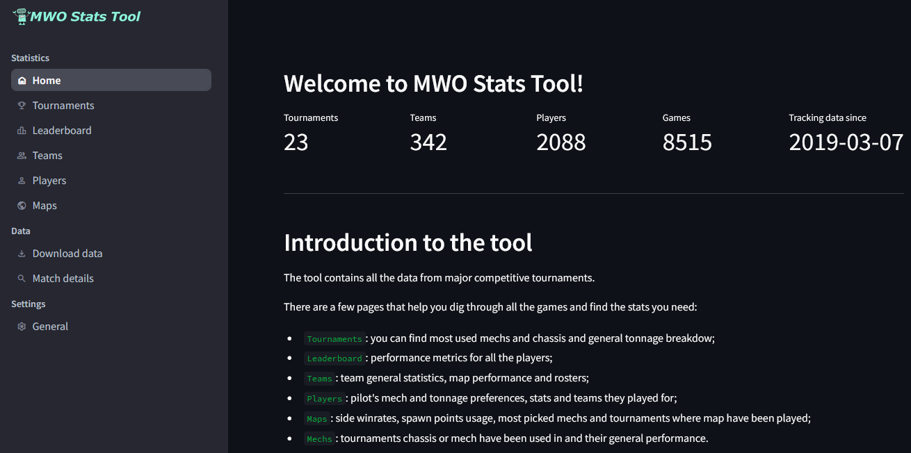

<!-- PROJECT SHIELDS -->
[![Contributors][contributors-shield]][contributors-url]
[![MIT License][license-shield]][license-url]
[![][version-shield]][version-url]

<!-- PROJECT NAME -->
<br/>
<div align="center">
    <a href="https://github.com/iT-Drake/MWOCompStatsVisualization">
        
    </a>
    <h3 align="center">MWO Competitive Stats Visualization</h3>
    <p align="center">
        A web application that helps you visualize data from competitive matches.
    </p>
</div>

<details>
  <summary>Table of contents</summary>

- [About The Project](#about-the-project)
- [Getting Started](#getting-started)
  - [Deployment](#deployment)
  - [Data-files structure](#data-files-structure)
    - [Mech data](#mech-data)
    - [Team rosters](#team-rosters)

</details>

<!-- ABOUT THE PROJECT -->
## About The Project



This application is designed to fetch API data, store it during the tournament and visualize stats for teams and pilots.

<!-- GETTING STARTED -->
## Getting Started

### Deployment

For a Linux-based system:
- Make a folder for the project
- Clone repository:
  ```shell
  git clone https://github.com/iT-Drake/MWOCompStatsVisualization.git
  ```
- Create virtual environment with Python, activate it and install dependencies:
  ```shell
  python3 -m venv .venv
  . .venv/bin/activate
  .venv/bin/pip install -r requirements.txt
  ```
- In a `.streamlit` folder of your clonned repository there will be two files:
  - config.toml - stores themes and other streamlit settings;
  - secrets.toml - stores your API key and urls for mechs and team rosters, here is the list of the keys:
    ```
    ; Database file name let you store data for different tournaments in separate files
    DB_NAME=Tournament.sqlite3

    ; Your key from https://mwomercs.com/profile/api
    API_KEY=<provided_key>

    ; URL template, stays the same until PGI will change it
    API_URL=https://mwomercs.com/api/v1/matches/%1?api_token=%2

    ; CSV filename or a link to a shared google spreadsheet with mech data
    MECH_DATA_URL=https://docs.google.com/spreadsheets/d/<YOUR_DOCUMENT_ID>/export?format=csv&gid=<YOUR_PAGE_ID>

    ; CSV filename or a link to a shared google spreadsheet with team rosters
    ROSTER_URLS=Rosters.csv
    ```
- Run `Streamlit`:
  ```shell
  streamlit run app.py
  ```
- Run your browser, go to `http://serveraddress:8501` and test the application.

### Data-files structure

#### Mech data

Data returned by PGI's API contains only mech id and original name without any information about its weight class or tonnage. So we need to provide additional information to make API data human readable. Mech data file should have the following structure:
| ItemID  | OriginalName  | Name    | Chassis | Tonnage | Class   | Type    |
|---------|---------------|---------|---------|---------|---------|---------|
| 1       | hbk-4g        | HBK-4G  | HBK     | 50      | MEDIUM  | NORMAL  |
| 57      | com-tdk       | COM-TDK | COM     | 25      | LIGHT   | HERO    |

You can find current official list of all mechs in JSON format at [mwomercs](https://static.mwomercs.com/api/mechs/list/dict.json).
And a template file with data from NOV 2024 [here](data/mechdata.csv).

#### Team rosters

For scalability purpuses, rosters data have two parts:
1. A list of all tournaments with links to corresponding team rosters (link/path to it should be provided in `ROSTER_URLS` secrets key). File structure is the following:
  
    | Tournament | RosterLink                                                                                     |
    |------------|------------------------------------------------------------------------------------------------|
    | CS24       | https://docs.google.com/spreadsheets/d/<YOUR_DOCUMENT_ID>/export?format=csv&gid=<YOUR_PAGE_ID> |

1. Actual rosters file that contains information about team and division a pilot belongs to. You need that information because PGI's API data doesn't contain no details besides pilot name and map side they started at. File structure is the following:

    | Pilot | Team      | Division |
    |-------|-----------|----------|
    | Name  | Team name | A        |

<!-- MARKDOWN LINKS & IMAGES -->
[contributors-shield]: https://img.shields.io/github/contributors/iT-Drake/MWOCompStatsVisualization.svg?style=for-the-badge
[contributors-url]: https://github.com/iT-Drake/MWOCompStatsVisualization/graphs/contributors

[license-shield]: https://img.shields.io/github/license/iT-Drake/MWOCompStatsVisualization.svg?style=for-the-badge
[license-url]: https://github.com/iT-Drake/MWOCompStatsVisualization/blob/main/LICENSE

[version-shield]: https://img.shields.io/badge/Version-0.2-blue?style=for-the-badge
[version-url]: https://github.com/iT-Drake/MWOCompStatsVisualization
